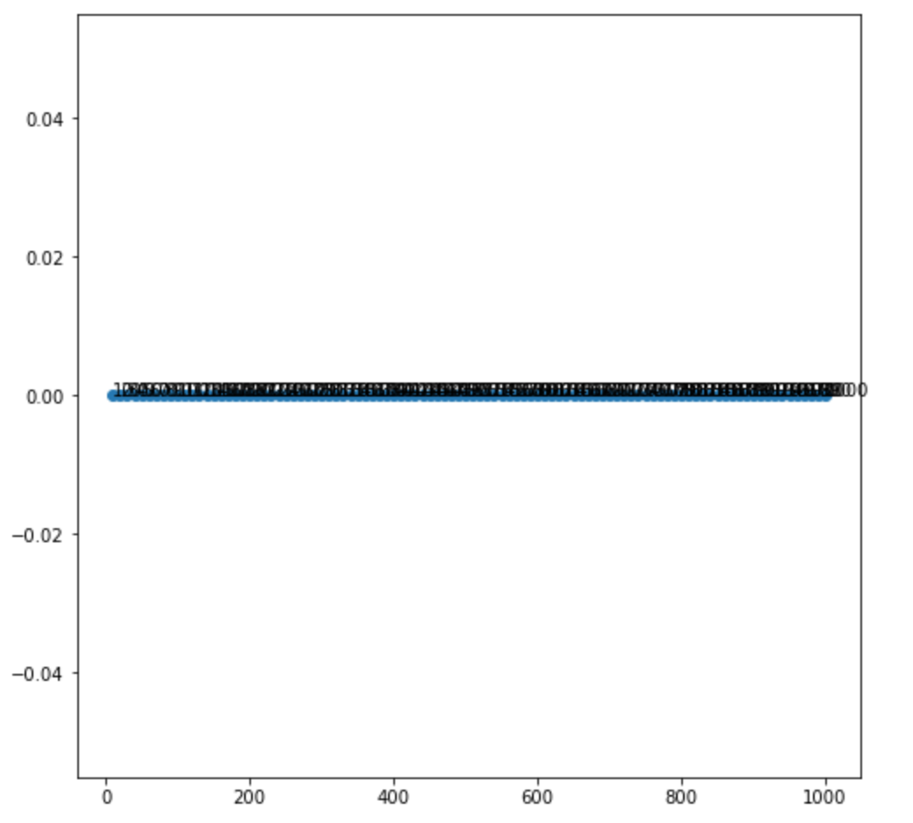
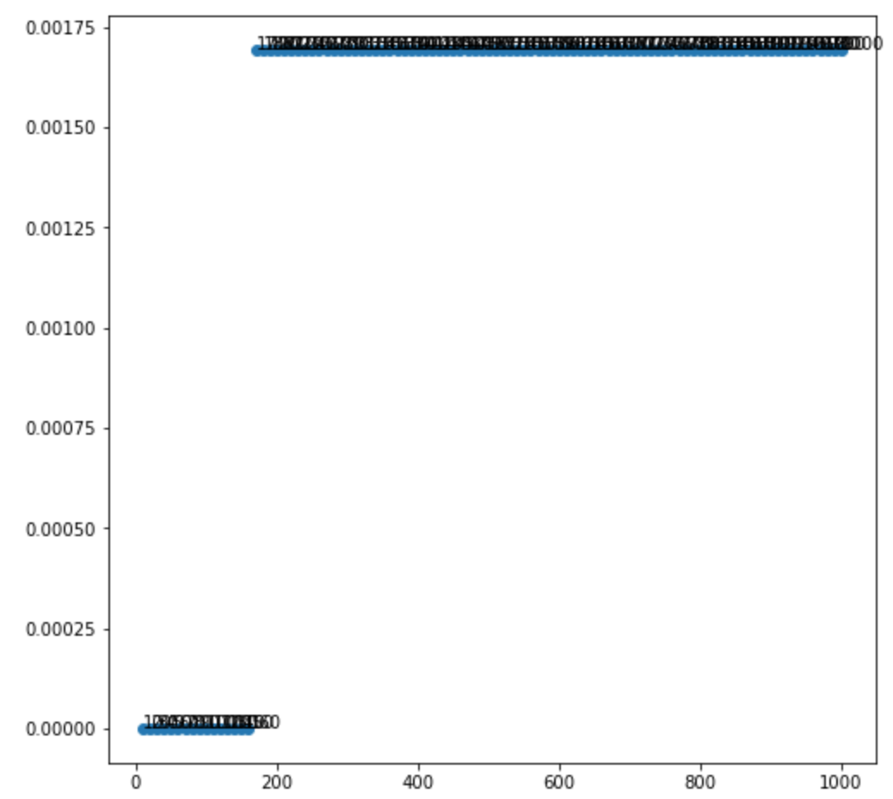
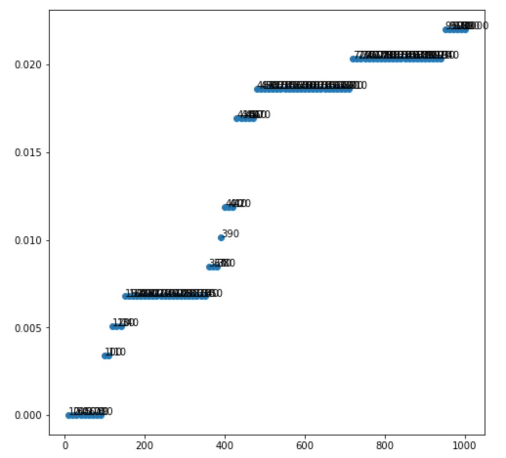
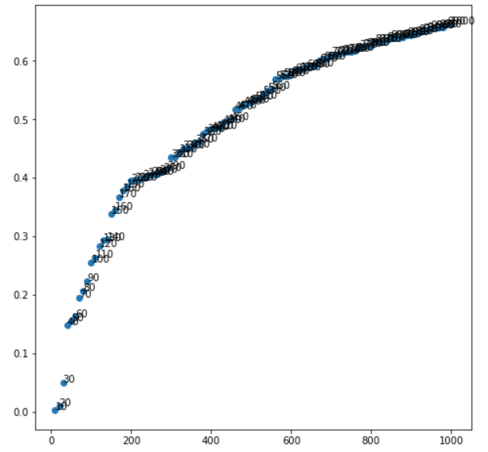

# 實作「Content-based」的推薦系統

# 目地
這專案是截取 2014 年 Amazon 發布的「美妝（All Beauty）」資料集，包含了
* 評論資訊 (評價星級、文字評價、投票等)
* 商品後設資料 (商品描述、類別、價格、品牌、圖片資訊等)

本專案希望可以實作「content-based」的推薦算法，找使用者可能會購買的商品。

推薦分數是採用 Recall 的評估機制，也就是檢查「使用者真正會購買的商品中」，有哪些會出現在「推薦給使用者的商品中裡」。

以混淆矩陣(Confusion Matrix) 來說：
```
FP  |  TP
FN  |  TN
```

```
使用者沒有買，在推薦的商品        |  使用者真的有買的，推薦的商品中
使用者真的有買的，不在推薦的商品中  |  使用者沒有買，不在推薦的商品中
```

我們計算

```
recall = (使用者真的有買的，推薦的商品中) / (使用者真的有買的，推薦的商品中 + 使用者真的有買的，不在推薦的商品中)
```

# 策略
使用商品資訊做分類，當使用者買過某商品時，用那商品的分類，提供同分類的商品。

我們採用基本的 Feature Selection 與 Similarity 來做分類。

使用非結構化資料：
* Method 1： 使用 `description` 欄位，以單字出現的頻次找出 TF-IDF，再做分類
* Method 2： 使用 `title` 欄位，以單字出現的頻次找出 TF-IDF，再做分類

使用結構化資料：
* Method 3: 使用 (`rank`, `最近一次的評論的新鮮度`) 做為 feature vector。這裡：
    * `rank` 的值normalize 到 0~1 之間
    * `最近一次的評論的新鮮度` 的值 normalize 到 0~1 之間， 0 表示越舊的資料，1 表示越新的資料

理想上，我希望依照「高評分和越近的評論」做分類

# recall 的結果
Method 1 ~ Method 3  算出的 recall 可以說都是 0。因為

```
所有測試的人 = 在訓練集中 + 不在訓練集中
584        = 38       + 546
```

因為大部分的人都不在訓練集中，這表示我們若使用推薦「買過商品中，推薦描述相似商品」的方法，應該都不會得到好的 recall 結果。

# 失敗的分析
雖然失敗了，但我試圖確認：在從相似清單選出 k 個是否對 recall 有影響力？

> 注意：因為 recall 計算沒有考慮到 FP（使用者沒有買，在推薦的商品) ，所以從推薦相似商品清單再選出”精選 k”對 recall 是沒有幫助的。

對 Method 1 ~ Method 3，計算 k = 10, 20 , 30, ...，看看 recall 的變化。

Method 1：使用 `description` 欄位


Method 2：使用 `title` 欄位

從 k = 170， 開始出現非 0 recall

Method 3：使用 (`rank`, `最近一次的評論的新鮮度`)

從 k = 100， 開始出現非 0 recall

從結果來看，Method 3：使用 (`rank`, `最近一次的評論的新鮮度`) 對於 recall 的提高比較有幫助

# 額外的嘗試 - 混合 content-base + rule-base
以　”(rank, 最後評論的日期)”　為基礎：
1. 有購買記錄的人：用 content-base， 拿”(rank, 最後評論的日期)” 當特徵向量
2. 沒有購買記錄的人：用 rule-base,　排序 ”(rank, 最後評論的日期)” 向量長度，選 k 個
```
[[10, 0.003389830508474576],
[20, 0.010169491525423728],
[30, 0.05084745762711865],
[40, 0.14915254237288136],
[50, 0.15593220338983052],
[60, 0.16271186440677965],
[70, 0.19491525423728814],
[80, 0.20677966101694914],
[90, 0.22372881355932203],
[100, 0.2559322033898305],
...
```
從 k = 10，recall 就會 > 0，對於沒有購買記錄的人來說，用 rule-base 改善 recall 是必要的。


