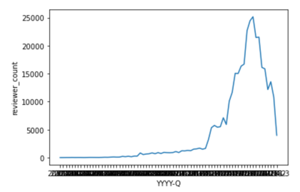
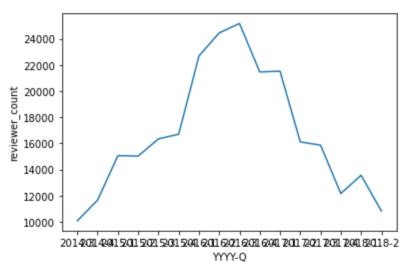
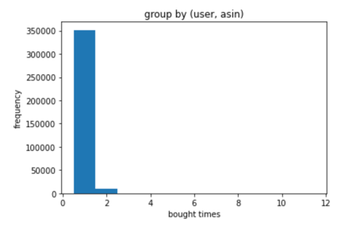
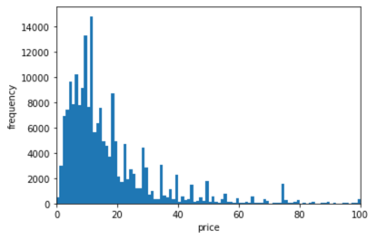

# 實作「Content-based」的推薦系統

# 目地
這專案是截取 2014 年 Amazon 發布的「美妝（All Beauty）」資料集，包含了
* 評論資訊（購買資料） (評價星級、文字評價、投票等)
* 商品後設資料 (商品描述、類別、價格、品牌、圖片資訊等)

本專案使用「collaborative filtering」的推薦算法，找使用者可能會購買的商品。

推薦分數是採用 Recall 的評估機制，也就是檢查「使用者真正會購買的商品中」，有哪些會出現在「推薦給使用者的商品中裡」。

以混淆矩陣(Confusion Matrix) 來說：
```
FP  |  TP
FN  |  TN
```

```
使用者沒有買，在推薦的商品        |  使用者真的有買的，推薦的商品中
使用者真的有買的，不在推薦的商品中  |  使用者沒有買，不在推薦的商品中
```

我們計算 recall 評估推薦算法

```
recall = (使用者真的有買的，推薦的商品中) / (使用者真的有買的，推薦的商品中 + 使用者真的有買的，不在推薦的商品中)
```

# 資料整理
`ratings_trainings`: 購買資料以 2018-09-01 以前為訓練資料
`ratings_testings`: 2018-09-01 ~ 2018-09-01 的資料作為測試資料

# 協同過濾(collaborative filtering)
協同過濾 cf(collaborative filtering) 可以分為 user-based 和item-based。
使用購買資料取出 rating，再建構出相似算法的 similarity matrix。

|          | user-based(基於使用者相似推薦)                           　　　　　　　     | item-based(基於商品相似推薦)            |
|----------|------------------------------------------------------------------------|-----------------------------|
| 適用場景 | 如：news／blog，因為文章的更新頻高，若用 item-based 熱門news 不容易出現           | 使用者　＞　物品 ，如：店商 |
| 多樣性   | 會頃向熱門                                                                | 多樣性大                    |
| 用戶特性 | 基於使用者，新加入的　user 沒資料 (cold start)                                | 適合沒有 user 資料的情況    |


本專案分別自己實作和使用surprise.KNNBasic實作。

| 實作              | user-based                                               | item-based    |
|-------------------|---------------------------------------------------------|--------------|
| 自己實作           | 實際推薦只有兩人，且完全沒有推薦中。 recall=0 | 有一些算的出來(約38人有推薦)，但只有1人成功，0.001694915254237288 |
| surprise.KNNBasic | 算不動                                                  | 有一些算的出來(約38人有推薦), 0.001694915254237288 ~ 0.005084745762711864 (1 ~ 3 人成功)|

## rating 的取法

rating 的取法有兩種取法：
1. 最新的 overall： 在 `ratings_trainings` 購買資料中有 **overall**(0~5) 可以直接作為 rating 值用，若使用者重覆購買，選最新的**overall**。 
2. 購買資料 overall 的加總：因為 rating 算是使用者對商品的喜好程度，若重覆購買，應該也可以視為更喜歡，所以把**overall**直接加總也可以視為 rating。

## 超過 k　的精選策略
使用 similarity matrix 可以選出大量的數量的商品，再精選取出 k 個。
在我們使用 item-based 時，發現這種「擴大後精選」效果機機乎沒有效，算的又久，又可能更糟。

精選策略：
1. 不精選，有多少給多少
2. 前 k 個 (依使用者購買近日期，找出相似商品)
3. 使用價低者
4. 價低且最近

## EDA

### 評論數統計 - 用於資料清洗
因為 cf 需要比較大量的計算量，我們統計以 (年, 季度)　統計，發現
```
2014-Q3 - 2018-Q2 期間的評論人數大於 10000
```



所以，訓練評論資料，會只留下 "2014-Q3 - 2018-Q2" 期間的評論資料。

同時，確認一下過濾後的資料的有效性 (會不會濾完後沒辨法算cf了)
```
原始訓練資料多少人? 323489
2014-3 - 2018-2 期間有多少人? 259103 (80.0963 %)
2014-3 - 2018-2 期間的人有含蓋 5.30821 % 的測試者，共 31 人
```
過濾後的資料還涵蓋　80.0963 %　的人，還算可以。

### 購買次數的統計　- 分析人和商品的關聯強弱



```
購買次數 發生次數 (group by (user, asin))
      1  351534
      2    9325
      3      85
      4      56
      5       3
      6       3
     11       2
      7       1
      8       1
      9       1
     10       1
```
* 重覆購買次數很少，但還是有人會重復買
* 多數為只購買一次的人，所以若使用 user-based 的話，就會因為用戶購買次過少，無法找到”相似用戶”。 

### 購買價格的統計　- 用於精選推薦商品

大部分商品都在100元以下。


30 元以下的商品購買次數很多。

若需要精選推薦商品這可以做為一個參考。

## cf 推薦 - user-based
rating 的取法不論是哪個得到的，recall 都是零，且實際推薦只有兩人，且完全沒有推薦中。

實際有推薦的人太少，應該是因為用戶購買次過少，這使關聯 user<-> item 太少，導致 user <-> item<-> user 不容易找到”相似用戶”。

## cf 推薦 - item-based

在 item-based 中，用

說明
```
hit_count: 有推薦，有命中 
fail_count: 有推薦，沒有命中
no_rec_count：沒有推薦
hit_user： 有命中的人
```

測試結果
1. rating: `最新的 overall`
   超過 k　的精選策略，不論是 `不精選，有多少給多少`、`前 k 個`、`使用價低者`、`價低且最近` 結果都一樣
    ```
    recall: 0.003389830508474576
    hit_count: 2
    fail_count: 30
    no_rec_count: 558
    hit_user: ['A2M4YSOJZELJ6N', 'A3BT1WLPENXMD6']
    ```
2. rating: `購買資料 overall 的加總`
    超過 k　的精選策略，不論是 `不精選，有多少給多少`、`前 k 個`、`使用價低者`、`價低且最近` 結果都一樣
    ```
    recall: 0.003389830508474576
    hit_count: 2
    fail_count: 30
    no_rec_count: 558
    hit_user: ['A2M4YSOJZELJ6N', 'A3BE6JK97CYAGA']
    ```
3. 若採用所有的訓練評論資料（不去過濾 "2014-Q3 - 2018-Q2" 期間的評論資料)，rating: `最新的 overall`且`不精選，有多少給多少`。
    ```
    recall: 0.001694915254237288
    hit_count: 1
    fail_count: 38
    no_rec_count: 551
    hit_user: ['A3BT1WLPENXMD6']
    ```
    反而正確推薦的人變少了。

# 結論

* 分析人和商品的關聯弱的資料來說(用戶購買次少/新戶多)，cf-item-based 可能比較好。
* ”超過 k 的精選策略” 幾乎沒有什麼幫助，反而是 "rating 的設計"有比較大的影響 (命中的人不一樣了)。
* 採用所有的訓練評論資料，反而 recall 會下降。
* "有推薦，但沒有命中" 的數量太高。
* 沒有推薦的人太多了，應該要混合 rule-base 推薦。


# 附錄
## 查看包含正確購買商品時，需要多大的 k
使用 `sum_overall` 和`前 k 個`的方式做為 rating，下表為"包含正確購買商品的k"。

原來的想法是：選出比 k 的數量，然後再”精選策略”用來選出 k 個

大部分的結果反而更糟，或是只有一種組合可以多增加 1 人中命，反而突顯這不是很好的想法。

| user           | 購買紀錄  -> 測試集的正確購買     | 包含正確購買商品的k |
|----------------|-------------------------------|---------------------|
| A3BT1WLPENXMD6 | B0013NB7DW -> B01E7UKR38      | 27                  |
| A3BT1WLPENXMD6 | B019809F9Y -> B01E7UKR38      | 35                  |
| ATJRZUXNWAWIK  | B01DKQAXC0 -> B01DDQXRWU      | 197                 |
| A19503XX7GU6J2 | B019Z9LAPK -> B01CTQC9J2      | 382                 |
| A19503XX7GU6J2 | B019Z9LD98 -> B01CTQC9J2      | 395                 |
| A2XFJ8CTY7VDNN | B0067F28ZW -> B01CTQC9J2      | 537                 |
| A7JUHUYLXIUVQ  | B00BOJKTM0 -> B01GW09XRW      | 541                 |
| A28E3FNV1BYC94 | B00U1VSN98 -> B0195R1FT8      | 597                 |
| A2IMJV0CQMZLGC | B0195R1FT8 -> B016YROO36      | 609                 |
| A1EY751AUVO5NZ | B01ENDFXJW -> B01E54U1RI      | 918                 |
| A16Y7V1CZCWKFV | B015ZOWER2 -> B01E54U1RI      | 938                 |
| A1WSZED2O5MA5T | B000WYJTZG -> B018WCT01C      | 1209                |
| A3H8Z7JS7XJHJJ | B015TAM2LK -> B01FWP41H0      | 1377                |
| A3H8Z7JS7XJHJJ | B00R8J13W0 -> B01FWP41H0      | 1379                |
| A4IQXCCXDEAKW  | B001860E92 -> B01GK8P0CS      | 1880                |
| A4IQXCCXDEAKW  | B013L9TX22 -> B01GK8P0CS      | 1891                |
| A2IOBG1ERS4JP3 | B00JIN3QEM -> B01F1Y2YSK      | 1958                |
| A2AAQWBJJTK3E1 | B00NFUXX6K -> B01BI8YFAS      | 2000                |
| AITF34BGBMVJJ  | B01GLA54SA -> B01ES87TOY      | 2109                |
| AGRZQOBCF8H87  | B00OPTR5GE -> B01ES87TOY      | 2112                |
| AQYL4TDY2HU8Z  | B003B6QR5M -> B01CRSWZAU      | 2534                |
| A1PR178735XC70 | B00NNLURMY -> B01CRSWZAU      | 2538                |
| AK7YIZE6ZZ1N9  | B00M2J4HXI -> B01HC6G4D6      | 3069                |
| A1TP9JHTIY468V | B01CTKQL56 -> B01CT5SNQQ      | 3137                |
| A1TP9JHTIY468V | B01E6NITSG -> B01CT5SNQQ      | 3149                |
| A2XY3CJ3ZCAD03 | B00015XAQA -> B01D8BV4VG      | 4636                |
| A1WEFBEJ7OHSVZ | B002OITLG0 -> B0178H2LK4      | 5523                |
| A3DXW3542E4QUC | B000V5PC70 -> B01D575H1G      | 5991                |
| A13JU88JAHN72I | B009YDVB6Q -> B017I6B6GK      | 6037                |
| ACE1ZIOI3U6PY  | B007NIR2C6 -> B01GOSELHE      | 6125                |
| ACE1ZIOI3U6PY  | B00PZBBVZM -> B01GOSELHE      | 6125                |
| ACE1ZIOI3U6PY  | B00JY0PHJQ -> B01GOSELHE      | 6128                |
| A2BU6N5956T9NH | B00W259T7G -> B01FDO0GNI      | 6572                |
| A29834GBB4DOP1 | B01COREXYA -> B01G00BHN2      | 7279                |
| A2JCBLTLYDPQLW | B00NE5ZHB0 -> B01F47TKXQ      | 7703                |
| ANR73TPVBCQ9K  | B010USX5S0 -> B01CWJHZW2      | 7861                |
| A7Y4ETTLARUGI  | B00IUOH3KS -> B01DTU7YNI      | 8440                |
| A3GRQ9WMP4OXFE | B00D7C9YQ4 -> B01HFT13NG      | 11905               |
| A2GFPTQ4VWDX96 | B012BG2TIG -> B01FT94H1Y      | 16637               |
| ASGIVOW34XNQS  | B000FQVJXQ -> B01CGPN2D8      | 17374               |
| ASGIVOW34XNQS  | B01EGT3NNG -> B01CGPN2D8      | 17374               |
| ASGIVOW34XNQS  | B0006O10P4 -> B01CGPN2D8      | 17380               |
| A1UAOE8KO7Q1DZ | B006NXZ7TC -> B01DL7KJ04      | 23567               |
| A3JEQJCEMX20GI | B007Z5RTRK -> B01FNIZH6A      | 28771               |
| A3JEQJCEMX20GI | B01BUNDOIA -> B01FNIZH6A      | 28771               |
| A1SA3N793WT2LM | B0075OYLKY -> B01GAFCQOQ      | 29255               |
| A1SA3N793WT2LM | B012TQ6AXS -> B01GAFCQOQ      | 29255               |
| A1SA3N793WT2LM | B0054H0NZ6 -> B01GAFCQOQ      | 29256               |
| A1SA3N793WT2LM | B007EITOSK -> B01GAFCQOQ      | 29256               |

